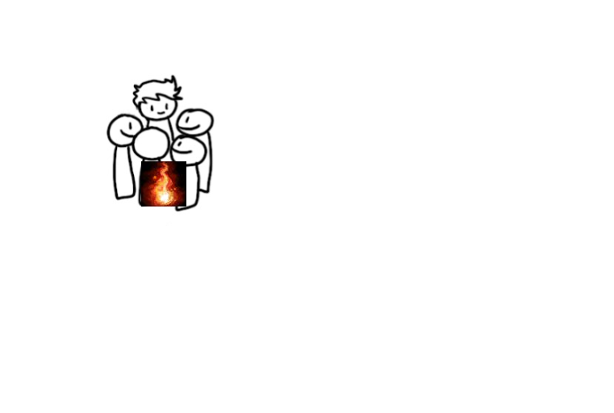
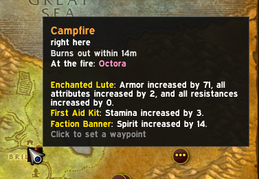
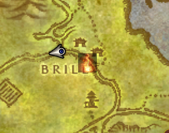

# Campfires

A World of Warcraft addon for WoW Forever that shows you where other players
have set up camp. When someone running Campfires sits down at a campfire,
everyone else running it sees the fire on their world map and minimap, who's
there, what's set up around it, and how long it has left.

## Install

1. Download `Campfires.zip` from the
   [latest release](https://github.com/frogwizard-dev/campfires/releases/latest).
2. Unzip it into `World of Warcraft\_classic_beta_\Interface\AddOns\`, so that
   you have an `AddOns\Campfires` folder containing `Campfires.toc`.
3. Start the game (restart it if it was already running) and check that the
   addon is enabled on the character select screen (AddOns button).

## Using it

- Sit down at a campfire. Once you have the Welcoming Campfire buff, the fire is
  shared with everyone else running the addon.
- Type `/fires` or click the minimap button to see every fire you know about,
  nearest first. Click one to set a waypoint (TomTom if you have it, otherwise
  the game's own).
- Hover over a fire on the map to see who's there, how long it has left, and
  what's set up at the camp (Tent, Mana Well, Incense Candle and so on).
- A name with a `?` after it was passed on by another player and hasn't been
  confirmed yet.

Campfires burn for 15 minutes. A fire disappears from the map when its time is
up, three minutes after everyone has left it, or straight away if someone
sitting at it sees it go out.

## Commands

| Command | What it does |
|---|---|
| `/fires` | Open or close the Campfires window |
| `/fires list` | List known fires in chat, nearest first |
| `/fires go [n]` | Set a waypoint to the nearest fire, or the nth in the list |
| `/fires ping` | Ask other players about fires in your zone |
| `/fires add` | Mark a fire where you're standing |
| `/fires share everyone` / `guild` / `nobody` | Who sees where you are when you're at a fire |
| `/fires show zone` / `everywhere` | Show fires in your zone only, or everywhere |
| `/fires quiet` | Turn alerts about new fires on or off |
| `/fires range <yards>` | How close a new fire has to be for a raid warning (default 250) |
| `/fires linger <seconds>` | How long fires nobody is at stay listed (default 180) |
| `/fires minimap` | Show or hide the minimap button |
| `/fires ignore <name>` | Hide someone's fires and name (on its own, lists who you're ignoring) |
| `/fires unignore <name>` | See someone's fires again |
| `/fires clear` | Forget every fire |
| `/fires camp` | Show what your Camp Benefits buff says is at the camp |

## Privacy

Only fires you're sitting at are shared, along with your character name and
class. Use the Share button in the window, or `/fires share`, to share with
everyone, only your guild and group, or nobody. You'll still see other
people's fires whichever you choose.

## Blocking players

Campfires ignores anyone on your in-game ignore list, and `/fires ignore
<name>` hides someone from Campfires only. Anyone sending fake campfire data
is muted automatically for an hour, and you'll get a message naming them.
Addons can't ban players, so if someone keeps at it, report them in game.
